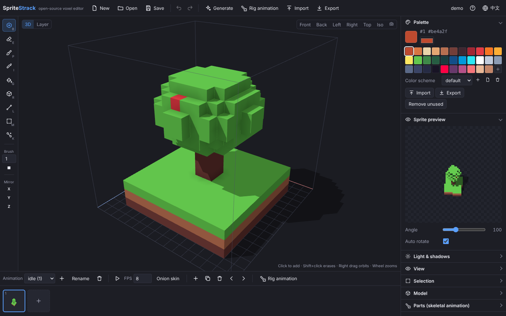

<p align="center"></p>

<h1 align="center">SpriteStrack</h1>

<p align="center">An open-source voxel editor: model, animate, and export 2D sprites (3D to 2D) or 3D models. Inspired by SpriteStack.</p>

<p align="center">
  <a href="README.md">中文</a> ·
  <a href="https://zuobai7.github.io/spritestrack/">Use it online</a> ·
  <a href="https://github.com/zuobai7/spritestrack/releases">Desktop downloads</a> ·
  <a href="docs/plugins.en.md">Plugin docs</a>
</p>



## Features

**Modeling**

- 3D mode and layer mode: in layer mode you draw one slice at a time like pixel art, with the layers above shown as a faint ghost
- Tools: add, erase, paint, pick, fill, box, line, select, part; brush size 1–16, cube or sphere; X / Y / Z mirroring
- Edit preview: hovering the model highlights the voxels a fill, paint or erase would change (mirrored parts included); fill says how many voxels it will recolor and the eyedropper shows the color it will pick
- Selection: drag a box or click a connected object; copy, cut, paste, move, flip, fill, paint
- Reference images on the front, side or top plane with opacity, size and offset; in layer mode they can follow the current layer for tracing
- Palette of up to 255 colors; import .hex / .gpl / image palettes, export .hex / .gpl / PNG; several color schemes you can switch with one click
- Light and shadows: the light is fixed to the camera, so lit faces and cast shadows change as the model turns or is exported at other angles; ambient occlusion; ground shadow
- Every edit can be undone and redone

**Animation**

- Several animations with any number of frames; FPS, playback, onion skin
- Part-based skeletal animation: split the model into parts (head, arms, legs), set pivots and parents, keyframe rotation and offset, use the swing, bob, spin and shake templates, then bake to regular frames

**Procedural generation**

- Built-in terrain, tree, rock, shape, house and flame generators with parameters and seeds; they can generate whole animations
- Custom scripts: write JavaScript in the editor; it runs in the background and endless loops are stopped
- Plugins: register your own generators with `SpriteStrack.registerGenerator()`, see the [plugin docs](docs/plugins.en.md)

**Import**

- Images to voxels: slice strips (sprite-stack sheets), extruded pixel art, heightmap terrain
- MagicaVoxel `.vox`; several models can become animation frames
- Minecraft structures: `.schem` files from WorldEdit and similar tools, and older MCEdit / Schematica `.schematic` files; every block becomes the closest palette color (or its own color is added to the palette), large structures can be scaled down, water and lava are optional
- `.sstrack` project files; drop them on the window to open

**Export**

- Sprites: slice stacking (pixel exact), 3D render (lit, orthographic or perspective), raw slice strips
- The view angle runs from 0 to 180: 90 is a level view, 180 looks straight down, below 90 looks up from underneath (3D render only); 135 is the classic sprite-stack view
- 1–32 angles, pixel scaling, outline, automatic trimming
- Sprite sheet PNG + JSON (the JSON-hash format Phaser and PixiJS read), one PNG per frame in a ZIP, animated GIF (the animation or a 360° turntable)
- Normal and depth maps aligned pixel for pixel with the colors, for 2D dynamic lighting
- All color schemes in one export
- 3D models: glTF (`.glb`, animated), OBJ + MTL, MagicaVoxel `.vox`

**Also**

- Chinese / English interface
- Autosave in the browser; installable as an offline web app (PWA)
- Desktop app for Windows, macOS and Linux (Tauri)

## Using it

- **Web**: <https://zuobai7.github.io/spritestrack/>
- **Desktop**: download the installer for your system from [Releases](https://github.com/zuobai7/spritestrack/releases). The installers are not code-signed:
  - on Windows, when SmartScreen says "Windows protected your PC", click "More info → Run anyway";
  - on macOS, right-click the app and choose "Open" the first time; if macOS says it is damaged, run `xattr -cr /Applications/SpriteStrack.app` in Terminal.
- **Controls and shortcuts**: click **?** at the top right of the editor or press <kbd>F1</kbd>.

Common shortcuts: <kbd>B</kbd> add · <kbd>E</kbd> erase · <kbd>P</kbd> paint · <kbd>I</kbd> pick · <kbd>G</kbd> fill · <kbd>R</kbd> box · <kbd>L</kbd> line · <kbd>M</kbd> select · <kbd>K</kbd> part · <kbd>Tab</kbd> 3D / layer mode · <kbd>Ctrl</kbd>+<kbd>Z</kbd> undo · <kbd>Ctrl</kbd>+<kbd>S</kbd> save · <kbd>Ctrl</kbd>+<kbd>E</kbd> export sprites · <kbd>Space</kbd> play

## Development

Requires Node.js 20 or newer.

```bash
npm install
npm run dev     # dev server at http://localhost:5173
npm test        # unit tests
npm run build   # type check and build to dist/
```

The desktop app also needs Rust and Tauri's system dependencies (see the [Tauri docs](https://v2.tauri.app/start/prerequisites/)):

```bash
npm run tauri dev     # run in a desktop window
npm run tauri build   # build installers
```

### Automation

- Every push to main is type-checked, tested and built by GitHub Actions (`.github/workflows/ci.yml`).
- The web app is published to GitHub Pages (`pages.yml`). Turn it on once under **Settings → Pages → Build and deployment → Source: GitHub Actions**.
- Pushing a version tag (for example `git tag v0.1.0 && git push origin v0.1.0`) builds installers for all three systems and creates a draft release (`desktop.yml`). You can also run **Desktop app** by hand from the Actions tab and download the installers from the run's artifacts.

### Layout

| Folder | Contents |
| --- | --- |
| `src/core` | Voxel grid, palette, project, undo, meshing, lighting, procedural generation, skeletal animation, image import, Minecraft structure (NBT) reading |
| `src/editor` | Editor state and every edit operation (all undoable) |
| `src/render` | Three.js 3D viewport |
| `src/export` | Sprite-stack renderer, 3D renderer, sprite sheets, GIF, OBJ, GLB, VOX, ZIP |
| `src/ui` | Interface: top bar, tool bar, sidebar, timeline and dialogs |
| `src/workers` | Runs custom scripts in a background thread |
| `src-tauri` | Desktop shell |
| `public` | Offline web app files (manifest, service worker, icons) |
| `tests` | Vitest unit tests |
| `docs` | Plugin docs and an example plugin |

### Project file format

`.sstrack` is JSON holding the size, color schemes, animations (each frame's voxels compressed with RLE and Base64) and the rig. See `src/core/serialize.ts`.

## Contributing

Issues and pull requests are welcome. Please run `npm run build` and `npm test` before submitting.

## License

[MIT](LICENSE)
