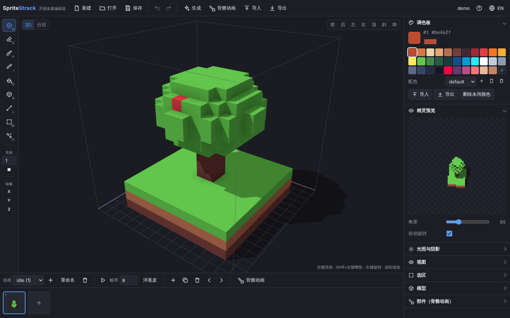

<p align="center"></p>

<h1 align="center">SpriteStrack</h1>

<p align="center">开源体素编辑器：建模、做动画，导出精灵图（3D 转 2D）或 3D 模型。灵感来自 SpriteStack。</p>

<p align="center">
  <a href="README.en.md">English</a> ·
  <a href="https://zuobai7.github.io/spritestrack/">在线使用</a> ·
  <a href="https://github.com/zuobai7/spritestrack/releases">下载桌面版</a> ·
  <a href="docs/plugins.md">插件文档</a>
</p>



## 功能

**建模**

- 3D 模式和分层模式：分层模式下逐层绘制，像画像素画一样，上方的层会显示成半透明的影子
- 工具：添加、擦除、上色、吸色、填充、方块、直线、选择、部件；笔刷大小 1–16，方形或球形；X / Y / Z 镜像
- 操作预览：鼠标停在模型上时，会高亮填充、上色、擦除将要改动的体素（含镜像部分），填充会提示改动多少格，吸管会提示将要吸取的颜色
- 选区：框选或点选相连物体，复制、剪切、粘贴、移动、翻转、填充、上色
- 参考图：放在正面、侧面或顶面，可调透明度、大小和位置，分层模式下可以跟随当前层描图
- 调色板：最多 255 色；导入 .hex / .gpl / 图片调色板，导出 .hex / .gpl / PNG；多套配色一键切换
- 光照与阴影：光源相对视角固定，旋转模型或导出不同角度时，受光面和投影会跟着变化；环境光遮蔽；地面阴影
- 全部操作都能撤销和重做

**动画**

- 多个动画，每个动画多帧；帧率、播放、洋葱皮
- 部件骨骼动画：把模型拆成头、手臂、腿等部件，设置轴心和父子关系，用关键帧做旋转和位移；内置摆动、起伏、旋转、抖动模板；最后生成为普通帧

**程序化生成**

- 内置地形、树、岩石、基础形状、房屋、火焰，可调参数和随机种子，可以直接生成动画
- 自定义脚本：在编辑器里写 JavaScript，后台运行，死循环会被自动停止
- 插件：用 `SpriteStrack.registerGenerator()` 注册自己的生成器，见 [插件文档](docs/plugins.md)

**导入**

- 图片转体素：切片条（精灵堆叠图）、像素画挤出、高度图地形
- MagicaVoxel `.vox`，多个模型可以变成动画帧
- Minecraft 结构：WorldEdit 等工具保存的 `.schem`，以及旧版 MCEdit / Schematica 的 `.schematic`；每种方块换成调色板里最接近的颜色（也可以把方块颜色加进调色板），太大的结构可以按比例缩小，水和岩浆可选
- 项目文件 `.sstrack`，拖进窗口就能打开

**导出**

- 精灵：切片堆叠（像素精确）、3D 渲染（带光照，正交或透视）、原始切片条
- 俯视角度用 0–180 表示：90 是平视，180 是从正上方往下看，小于 90 是从下往上看（只有 3D 渲染可以）；经典的精灵堆叠视角是 135
- 1–32 个角度，像素放大，描边，自动裁掉空白
- 精灵表 PNG + JSON（Phaser / PixiJS 使用的 JSON-hash 格式）、单帧 PNG 打包成 ZIP、GIF 动图（播放动画或 360° 旋转展示）
- 法线图和深度图，与颜色图逐像素对齐，可用于 2D 动态光照
- 一次导出全部配色
- 3D 模型：glTF（`.glb`，含动画）、OBJ + MTL、MagicaVoxel `.vox`

**其他**

- 中文 / English 界面
- 自动保存在浏览器里；可以安装成离线使用的网页应用（PWA）
- Windows / macOS / Linux 桌面版（Tauri）

## 使用

- **网页版**：<https://zuobai7.github.io/spritestrack/>
- **桌面版**：在 [Releases](https://github.com/zuobai7/spritestrack/releases) 下载对应系统的安装包。安装包没有代码签名：
  - Windows 提示“Windows 已保护你的电脑”时，点“更多信息 → 仍要运行”；
  - macOS 第一次打开请右键点应用选“打开”；如果提示“已损坏”，在终端运行 `xattr -cr /Applications/SpriteStrack.app`。
- **操作说明和快捷键**：在编辑器里点右上角的 **?** 或按 <kbd>F1</kbd>。

常用快捷键：<kbd>B</kbd> 添加 · <kbd>E</kbd> 擦除 · <kbd>P</kbd> 上色 · <kbd>I</kbd> 吸色 · <kbd>G</kbd> 填充 · <kbd>R</kbd> 方块 · <kbd>L</kbd> 直线 · <kbd>M</kbd> 选择 · <kbd>K</kbd> 部件 · <kbd>Tab</kbd> 切换 3D / 分层 · <kbd>Ctrl</kbd>+<kbd>Z</kbd> 撤销 · <kbd>Ctrl</kbd>+<kbd>S</kbd> 保存 · <kbd>Ctrl</kbd>+<kbd>E</kbd> 导出精灵 · <kbd>空格</kbd> 播放

## 开发

需要 Node.js 20 或更新版本。

```bash
npm install
npm run dev     # 开发服务器 http://localhost:5173
npm test        # 单元测试
npm run build   # 类型检查并构建到 dist/
```

桌面版还需要 Rust 和 Tauri 的系统依赖（见 [Tauri 文档](https://v2.tauri.app/start/prerequisites/)）：

```bash
npm run tauri dev     # 以桌面窗口运行
npm run tauri build   # 生成安装包
```

### 自动构建

- 每次推送到 main，GitHub Actions 会做类型检查、测试和构建（`.github/workflows/ci.yml`）。
- 网页版会自动发布到 GitHub Pages（`pages.yml`）。第一次需要在仓库 **Settings → Pages → Build and deployment → Source** 选 **GitHub Actions**。
- 推送版本标签（例如 `git tag v0.1.0 && git push origin v0.1.0`）会构建三个平台的安装包，并创建一个草稿 Release（`desktop.yml`）；也可以在 Actions 页面手动运行 **Desktop app**，安装包在运行结果的 Artifacts 里。

### 目录结构

| 目录 | 内容 |
| --- | --- |
| `src/core` | 体素网格、调色板、项目、撤销、网格化、光照、程序化生成、骨骼动画、图片导入、Minecraft 结构（NBT）读取 |
| `src/editor` | 编辑器状态和全部编辑操作（都可撤销） |
| `src/render` | Three.js 3D 视口 |
| `src/export` | 精灵堆叠渲染、3D 渲染、精灵表、GIF、OBJ、GLB、VOX、ZIP |
| `src/ui` | 界面：顶栏、工具栏、侧栏、时间轴和各个对话框 |
| `src/workers` | 在后台线程运行自定义脚本 |
| `src-tauri` | 桌面版外壳 |
| `public` | 离线网页应用文件（manifest、service worker、图标） |
| `tests` | Vitest 单元测试 |
| `docs` | 插件文档和示例插件 |

### 项目文件格式

`.sstrack` 是 JSON 文件，保存尺寸、各套配色、动画（每帧的体素数据用 RLE 加 Base64 压缩）和部件骨骼数据，读写代码在 `src/core/serialize.ts`。

## 参与

欢迎提 Issue 和 Pull Request。提交前请运行 `npm run build` 和 `npm test`。

## 许可证

[MIT](LICENSE)
